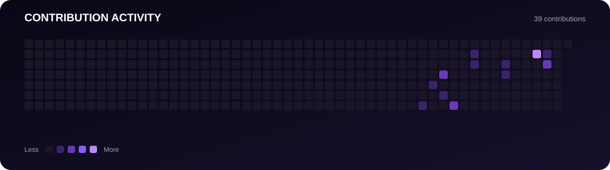

<h1 align="center">Rohit Kumar Singh</h1>

<p align="center">
  
</p>

<p align="center">
  <a href="https://readme-typing-svg.demolab.com/">
    
  </a>
</p>

<p align="center">
  
  
  
</p>

<p align="center">
  <a href="https://github.com/rohitksingh-021">
    
  </a>
  <a href="https://www.linkedin.com/in/rohitksingh021/">
    
  </a>
  <a href="mailto:rohitksingh2195@gmail.com">
    
  </a>
  <a href="https://github.com/rohitksingh-021">
    
  </a>
</p>

<p align="center">
  
  
  
</p>

---

## About

I’m **Rohit Kumar Singh**, a B.Tech Information Technology student focused on **software engineering, AI/ML, and full-stack product development**.

I enjoy building systems that go beyond demos — applications designed around real workflows, useful abstractions, reliable APIs, intelligent data retrieval, and practical user experiences.

My engineering interests span **full-stack development, AI-powered applications, retrieval-augmented generation, semantic search, LLM systems, backend architecture, and product engineering**.

During industry internships, I have worked on enterprise applications for **intern record management, workforce skill-gap analysis, and AI-powered organizational knowledge retrieval**.

I approach development with a product mindset:

> **Understand the problem → design the system → build the product → measure the impact → iterate.**

### Open To

- Software Engineering Internships
- AI/ML Engineering Opportunities
- Full-Stack Engineering
- Backend Engineering
- AI Product Engineering
- Open Source Collaboration
- High-impact Hackathons & Engineering Projects

---

## Tech Stack

### Languages

<p>
  
</p>

### Frontend

<p>
  
</p>

### Backend & Databases

<p>
  
</p>

### Cloud, DevOps & Tooling

<p>
  
</p>

<p align="center">
  
  
  
  
  
</p>

---

## AI / ML Expertise

| Domain | Proficiency | Details |
|---|---|---|
| Retrieval-Augmented Generation | Advanced | End-to-end RAG pipelines with document processing, embeddings, vector storage, retrieval and grounded generation |
| LLM Applications | Advanced | Natural-language interfaces, contextual generation and enterprise knowledge systems |
| Semantic Search | Advanced | Embedding-based retrieval and semantic document discovery |
| Hybrid Search | Advanced | Combining semantic retrieval with traditional search strategies |
| Vector Databases | Advanced | Embedding storage and retrieval for knowledge-intensive AI applications |
| Document Intelligence | Advanced | OCR, document processing and structured knowledge extraction |
| AI Agents | Intermediate | Multi-agent architectures for autonomous workflow and decision systems |
| AI-Assisted Training | Intermediate | AI-generated training content, quizzes and knowledge workflows |

---

## Featured Projects

<details>
<summary><strong>Grasim Intelligence Platform (GIP)</strong> — Enterprise AI Knowledge Platform</summary>

<br>

An AI-powered enterprise knowledge platform designed to let employees query **SOPs, technical and maintenance manuals, safety guidelines, incident reports, and training materials** using natural language.

| Attribute | Details |
|---|---|
| **Stack** | React, Next.js, TypeScript, FastAPI, PostgreSQL, Redis, Docker |
| **Scale** | Enterprise knowledge retrieval across operational documentation |
| **Performance** | Hybrid + semantic retrieval for contextual answers |
| **Security** | Role-Based Access Control |
| **Impact** | Faster access to organizational knowledge and operational information |
| **Repository** | Private / Enterprise Project |

**Engineering Scope**

- Designed an end-to-end **RAG architecture**
- Implemented document OCR and processing workflows
- Generated and stored document embeddings
- Built vector-based knowledge retrieval
- Implemented hybrid search
- Generated contextual LLM responses with source citations
- Added document summarization
- Built SOP version comparison
- Enabled incident knowledge retrieval
- Added AI-assisted training and quiz generation
- Implemented role-based access control

</details>

<details>
<summary><strong>Financial Twin AI</strong> — Autonomous Wealth-Building Platform</summary>

<br>

An autonomous financial intelligence platform designed to shift digital banking from a transactional record-keeping experience toward a **predictive financial partner**.

| Attribute | Details |
|---|---|
| **Stack** | Next.js 15, FastAPI, Multi-Agent Systems |
| **Scale** | Multi-agent financial planning architecture |
| **Performance** | Turn-by-turn goal navigation and predictive financial modeling |
| **Security** | Backend-oriented architecture for controlled financial workflows |
| **Impact** | Personalized financial guidance and future net-worth simulation |
| **Repository** | Available on GitHub |

**Engineering Scope**

- Architected a Next.js 15 frontend
- Designed a FastAPI-orchestrated multi-agent framework
- Built future net-worth trajectory simulations
- Designed a multidimensional **Financial Vitality Score**
- Developed **Wealth GPS** for goal-oriented financial navigation
- Applied autonomous-agent concepts to financial product engineering

</details>

<details>
<summary><strong>Intern Record Management Web Application</strong> — Enterprise Workflow Automation</summary>

<br>

A full-stack web application developed in partnership with the **Training Department** to replace manual intern tracking with centralized and automated workflows.

| Attribute | Details |
|---|---|
| **Stack** | Full-Stack Web Development |
| **Scale** | Training Department workflow |
| **Performance** | Centralized and streamlined record management |
| **Security** | Application-level access and controlled workflows |
| **Impact** | Improved accuracy and efficiency of intern record-keeping |
| **Repository** | Enterprise Project |

**Engineering Scope**

- Replaced manual tracking workflows
- Centralized intern records
- Improved data-entry processes
- Reduced dependency on fragmented manual record keeping
- Designed the system around real departmental requirements

</details>

<details>
<summary><strong>Skill Gap Analysis Tool</strong> — Workforce Intelligence Platform</summary>

<br>

A workforce-focused web application built with the **IT Department** to identify and quantify organizational skill gaps and support targeted employee upskilling.

| Attribute | Details |
|---|---|
| **Stack** | Web Application Development |
| **Scale** | Workforce-wide skill analysis |
| **Performance** | Data-driven skill-gap identification |
| **Security** | Controlled enterprise workflow |
| **Impact** | Supported employee upskilling and workforce planning |
| **Repository** | Enterprise Project |

**Engineering Scope**

- Designed skill-gap analysis workflows
- Built data-driven workforce insights
- Helped identify areas requiring employee development
- Supported targeted upskilling initiatives
- Connected technical insights with long-term workforce planning

</details>

---

## Experience

### Web Development Intern — Hindalco Industries Limited

**Aug 2025 – Sep 2025** · Onsite

Worked with the **Training and IT Departments** to build internal software solutions that improved operational workflows and workforce intelligence.

- Engineered an **Intern Record Management** web application
- Streamlined data-entry and intern record workflows
- Improved accuracy and efficiency of record keeping
- Collaborated with the IT Department on a **Skill Gap Analysis Tool**
- Built data-driven insights for employee upskilling initiatives
- Contributed to long-term workforce planning workflows

`Web Development` `Full Stack` `Enterprise Applications` `Workflow Automation`

### AI Engineering Intern — Grasim Industries Limited

**Jul 2025 – Aug 2025** · Onsite

Worked on the **Grasim Intelligence Platform**, an enterprise AI knowledge system for natural-language access to organizational documentation.

- Built an enterprise knowledge platform powered by AI
- Designed a complete **RAG pipeline**
- Implemented OCR and document processing
- Worked with embeddings and vector databases
- Implemented semantic and hybrid search
- Built contextual LLM responses with source citations
- Developed document summarization
- Implemented SOP version comparison
- Built incident knowledge retrieval
- Added AI-assisted training and quiz generation
- Implemented role-based access control

`AI Engineering` `RAG` `LLMs` `Semantic Search` `FastAPI` `Next.js` `PostgreSQL` `Redis` `Docker`

---

## Achievements

<p align="center">

| Recognition | Details |
|---|---|
| **Open Source Contributor** | Social Winter of Code & Google Solution Challenge |
| **Hackathon Finalist** | National Top 25 — Hackspace Hackathon |
| **Hackathon Finalist** | India’s First Agentic AI Hackathon |

</p>

---

## Certifications

### AI / Generative AI

<p>
  
  
  
</p>

- Develop Generative AI Applications
- Build RAG Applications & Vector Databases for RAG
- Introduction to Model Context Protocol (MCP)

### Product

<p>
  
</p>

- Product Management

---

## Coding Profiles

<p align="center">
  <a href="https://leetcode.com/">
    
  </a>
  <a href="https://www.geeksforgeeks.org/">
    
  </a>
  <a href="https://www.hackerrank.com/">
    
  </a>
  <a href="https://www.codechef.com/">
    
  </a>
</p>

---

## GitHub Analytics

<p align="center">
  
  
</p>

<p align="center">
  
</p>
---

## GitHub Trophies

<p align="center">
  
</p>

---

## Contribution Activity

<p align="center">
  
</p>

---

## Contribution Snake

<p align="center">
  
</p>

---

## Current Focus

```yaml
Learning:
  - Advanced System Design
  - Scalable Backend Architecture
  - AI Agents
  - Advanced RAG Systems
  - LLM Application Engineering

Building:
  - AI-powered enterprise applications
  - Full-stack production systems
  - Multi-agent products
  - Intelligent knowledge platforms

Exploring:
  - Agentic AI
  - Semantic Search
  - Vector Databases
  - Product Engineering
  - Developer Infrastructure

Open To:
  - Software Engineering Internships
  - AI/ML Engineering Opportunities
  - Full-Stack Engineering
  - Backend Engineering
  - Open Source Collaboration
  - High-impact Engineering Projects
